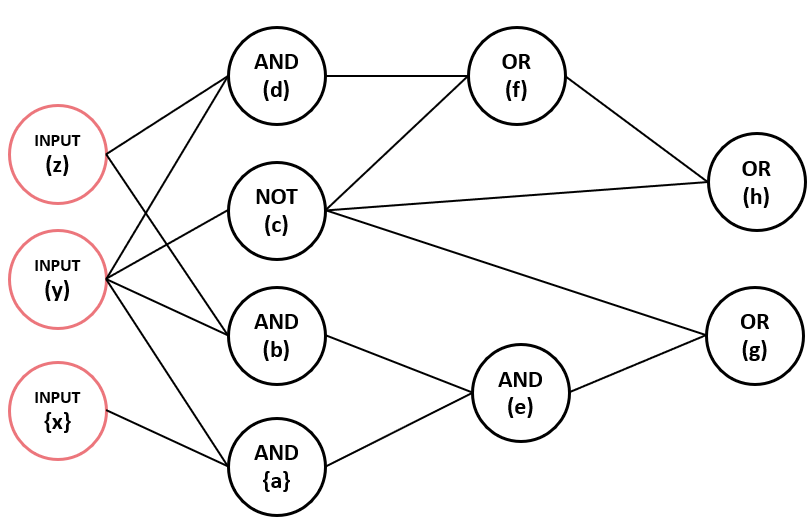

compile:
    make clean && make

run:
    ./mlrcs <-h/-e> <BLIF_FILE> <AND_CONSTRAINT> <OR_CONSTRAINT> <NOT_CONSTRAINT>
    example:
         ./mlrcs -h ./aoi_benchmark/aoi_sample02.blif 2 1 1
         ./mlrcs -e ./aoi_benchmark/aoi_sample02.blif 2 1 1

========================= Observations of -h and -e =========================
In my program, list scheduling picks any type of ready nodes by ID instead of following the critical path like Hu's algorithm. However, we can observe that no matter which nodes we pick, we will face problems in list scheduling. The drawback of list scheduling is that it only considers each type of node individually, which results in worse cases in my test case.

My observation is that we ignore balancing resource scheduling in each cycle. Although the circuit may require more resources to compute in certain paths, it overlooks that operations needing more resources can block operations that require fewer resources. This leads to the scheduling needing to spend more cycles to complete.

The following is an example:

We set resources <AND,OR,NOT> = <2, 1, 1> because the number of AND operations is the most in this example, so we set it to 2.
There are three critical paths in my example, e.g., {d-f-g}, {{a,b},e,g} need three cycles accomplish.

test_case.blif file path: <./aoi_benchmark/test/case.blif>

.inputs x y z
.outputs a b c d e f g h

Heuristic Scheduling Result
1: {a b} {} {c} 
2: {d e} {} {} 
3: {} {f} {} 
4: {} {g} {} 
5: {} {h} {} 
LATENCY: 5
END

In Heuristic Scheduling of 3-5 cycles, there are only schedule OR operation,
but we can realize that <time 2: { de }{  }{  }> dosen't schedule any OR operation in this cycle. It wastes resource in this cycle.
We can observe that it doesn't schedule AND operation {d} to result in more latency.
Therefore, this is one of drawback of list scheduling.  

ILP-based Scheduling Result
1: {b d} {} {c} 
2: {a} {f} {} 
3: {e} {h} {} 
4: {} {g} {} 
LATENCY: 4
END

In the ILP-based Scheduling, we can observe ILP picks AND operation {d}, then it improve other operations schedule.
As you can see, result of ILP-based Scheduling can distribute resource as many as possible in each cycle.
Even if path{d-f-g} is not a critical path, if there are many OR or NOT operations after {d}, this issue still exist.

<Conclusion>
No matter path is critical path or not, if we have different type of node in circuit, they will effected by each other.The best solution is hard to find by ILP, because I tried dataset aoi_big1.blif,but it spends too much time by ILP compared to Heuristic Scheduling.
If our problem is not too complicated, we can consider ILP solution.
If our problem is too complicated and getting nit bad solution in limited time, we can consider Heuristic solution.

Student ID: M11202158
